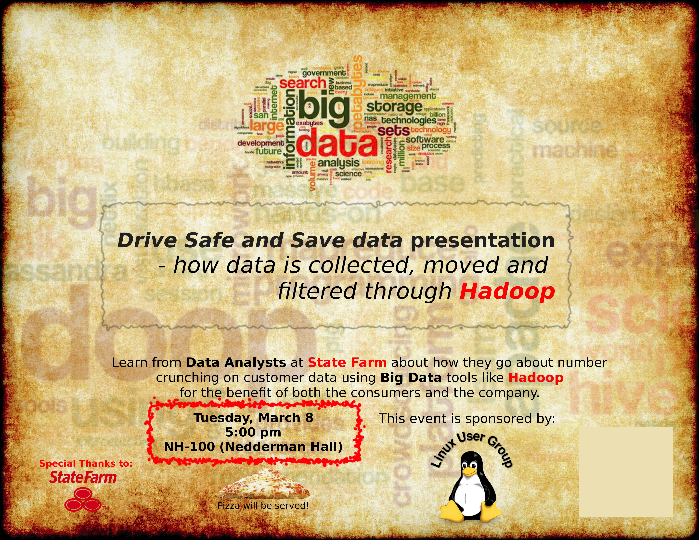

```{r setup, include=FALSE}
knitr::opts_chunk$set(echo = FALSE)
```

<link rel="stylesheet" type="text/css" href="style.css">

## What is Linux

- Linux is an Operating System (OS) – the software that manages its processor, memory and devices and lets you run different programs on it. Other OSes include Microsoft Windows and MacOS.
- Linux is free and open source.
- It has been developed collaboratively by many developers across the globe making it extremely robust and transparent.
- It is the number one OS running on the Internet – Google, Facebook, Twitter, Wikipedia and many other sites run on Linux OS.

## Why you might need Linux

- Software Engineers & System Administrators
    - Large websites like Google/Facebook run on Linux
    - Preferred programming environment
- Electrical Engineers
    - Most hardware (Android phones, R-Pi, smart TVs..) run Linux
- Robotics and Control Engineers
    - ROS based on Linux
- High performance computing
    - Supercomputers and clusters run on Linux

## Free Open Source

*“Free as in freedom”*

Software with source code available that you are free to study, change and distribute for any purpose. Examples GPL, BSD licenses.

*“Standing on the shoulders of giants”*

Imagine:

- Having to pay ridiculous amounts of money to start working on a new idea
- Not being unable to customize software to your needs

= stifled innovation!

## Open Source in Your Life

- Major websites:
Google, Facebook, Amazon, Twitter, Dropbox
- Software you use:
Mozilla Firefox, Oracle Java, VLC, LibreOffice
- Android smartphones
- Embedded Linux devices:
Smart TVs & DVRs, ATM machines, Wireless routers

## Linux Awareness

- Why haven't I heard of Linux before? Why did my laptop ship with Windows or MacOS?
    - In its early days, it was actually difficult get some things running on Linux. You needed some expert help.
    - There isn't much awareness about Linux outside the IT community.
    - Some hardware and software manufacturers provide software and support only for Windows.

## Brief History of Operating Systems

- In early days, computers were large multi-user mainframes running some flavor of the Unix operating system (1969).
- Personal Computers (PC) started using MSDOS (1981-2000), transitioning to Windows later (1990). 
- Mac-OS (1984) competed with Windows on Mac-PCs but Microsoft was always the bigger player . OS X was released in 2001 and is based on Unix (NeXTSTEP).
- Linux rose as a free Unix-”like” operating system now completely dominating the server market and becoming a popular PC OS. (1991-current)


## Learning Linux

Outline:

- Linux distributions
- Command line and GUI interface
- Installation
- Basic Shell commands

## Linux distributions {.smaller}

Most popular ones:

- Linux Mint
- Debian
- Ubuntu
- OpenSUSE
- Fedora
- CentOS
- Arch

<!--http://easylinuxstuff.com/2012/10/17/best-linux-distributions/-->


## Fedora

<!-- https://commons.wikimedia.org/wiki/File:Captura_Fedora_21_%28Gnome_Shell%29.png -->


## Ubuntu

<!-- https://en.wikipedia.org/wiki/Ubuntu_%28operating_system%29#/media/File:Ubuntu_15.10_with_Firefox_and_Nautilus_open.png -->


## Debian

<!-- https://en.wikipedia.org/wiki/Debian#/media/File:Docky_on_Gnome_Shell_of_Gnome_3,_Debian_GNU-Linux.png -->


## Linux Mint

<!-- https://en.wikipedia.org/wiki/Linux_Mint#/media/File:Lmde2.png -->


## Command line

<!-- https://en.wikipedia.org/wiki/Command-line_interface#/media/File:Linux_command-line._Bash._GNOME_Terminal._screenshot.png -->


## Installation

- Play safe - install in a Virtual Machine
    - only a tiny bit slower than a full install
    - no need to partition your hard drive
    - no need to mess with boot menus
    - you can easily launch Linux, pause it, resume it, keep it running in the background **without exiting Windwos or your Windows programs**!
    - you can set up shared folders to share your My Document, Desktop or even your whole drive with the VM.

## VM Installation instructions

- Download and install Oracle VirtualBox:
For the latest downloads always go to: [https://www.virtualbox.org/wiki/Downloads]

Windows users download link: [Windows](http://download.virtualbox.org/virtualbox/5.0.14/VirtualBox-5.0.14-105127-Win.exe)

Mac OSX users download link: [MacOS](http://download.virtualbox.org/virtualbox/5.0.14/VirtualBox-5.0.14-105127-OSX.dmg)

Download the ISO image of a Linux distribution (Ubuntu Linux or Linux Mint is recommended) 

- [Ubuntu 15.10 64-bit](http://releases.ubuntu.com/15.10/ubuntu-15.10-desktop-amd64.iso)
- [Linux Mint 64-bit](http://mirrors.kernel.org/linuxmint//stable/17.3/linuxmint-17.3-cinnamon-64bit.iso)

Note: amd64 means any Intel or AMD CPU - don't let that confuse you

## Installation

- Refer to this video for help in the install:

https://youtu.be/BSPVWOrMc3M

- To enable hardware acceleration options if they are not enabled on your laptop:

https://youtu.be/kC0BtOKTMHE

## More learning

- Watch these introductory videos on YouTube:
    - Take the Ubuntu Unity online tour!
http://tour.ubuntu.com/en/
    - A dummies introduction to Ubuntu: https://www.youtube.com/watch?v=Do5npazUXpM
    - An introduction to command line: https://www.youtube.com/watch?v=IVquJh3DXUA
    
## Next meeting



## Try the shell

Go to the address shown.
Login with the username and password on the piece of paper.

## Commands

You can try these commands in your shell window:

- **whoami** - prints your username
- **pwd** - tells your location in the file system
    - */home/username* is your **home** directory
- **ls** - lists the files in the current directory

We can add switches to commands to change their behavior:

- For the **ls** command:
    - **ls -F** - differentiates between files and folders
    - **ls -l** - shows additional file details
    - **ls -l -t** - combine -l and -t (sort by time) switches
    - **ls -F -a** - shows hidden files
        - the **.** means the current folder
        - the *..** means the parent folder
        - **.bash_history** stores your command history

- **tree** - displays the file system structure

## Commands

The following commands do things, like changing your current directory, creating and copying files etc.

- Try: **cd Desktop**
- Then try: **pwd**
    - What do you see?
- Try: **ls -F -a**
    - These are the files in the Desktop folder
- If you do: **cd ..**
    - This will take you  back to your home directory